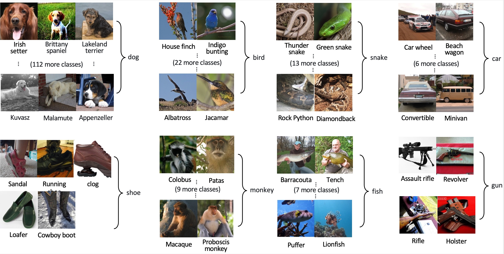

# Clustered ImageNet Labels

> This work was done as a term project in 2021 Spring CS570: Artificial Intelligence and Machine Learning, Prof: Tae-Kyun Kim, at KAIST.

[🔗 Project Report (Scientific Paper Style)](report.pdf)
[🔗 Clustered ImageNet Labels (json file)](trainer/data/clustered_imagenet_labels.json)

## Project Abstract

While using a pre-trained model is the easiest option for non-researchers when implementing a deep learning algorithm, most of the pre-trained models are trained with benchmark datasets which are far from the production applications.
In this study, we present Clustered ImageNet Labels (CIL) as a dataset for production-friendly image classifiers.
To reduce the management and computational cost, we merge labels of ImageNet while keeping the data in ImageNet unchanged, instead of composing a completely new dataset.
CIL includes 488 reduced classes, where too finely divided classes in ImageNet are grouped into a general category.
We demonstrate that a model trained with CIL obtains higher accuracy compared to the original ImageNet labels, and we show that creating a ready-to-hand image classifier can be done easily by finetuning the ImageNet pre-trained model with CIL.

*Sample mapping rules in **Clustered ImageNet Labels**, where too finely divided classes in original ImageNet are clustered into a general class.*

## How to use

You can use CIL when training an image classifier. 
Sample training code written in PyTorch is available at [trainer](./trainer).

