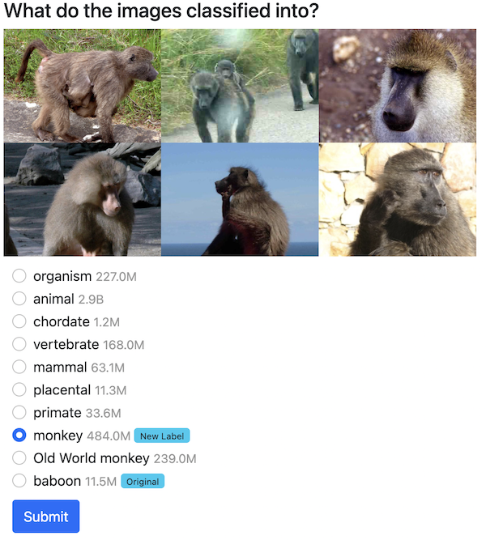

# Survey Application for Clustered ImageNet Labels

By using this application, we can collect data from multiple users and obtain clustered results from an average person's point of view.

To help users classify images more easily, candidates are provided based on the hierarchy, and Google search count is displayed for each candidate.



### How to run

```bash
$ docker-compose up -d --build
```
